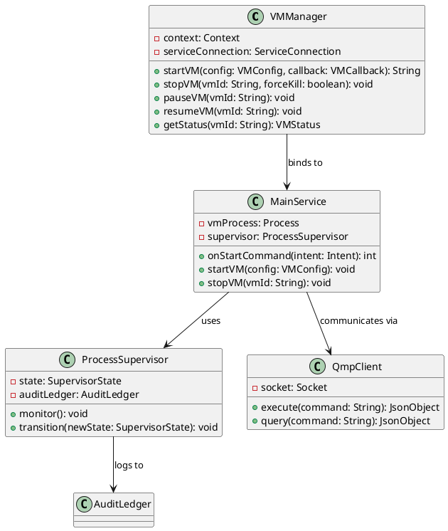

# 📚 MEGA-PROMPT DOCUMENTAÇÃO - Vectras-VM-Android

**Target**: Technical Writers / Developers / Documentation Engineers  
**Project**: Vectras-VM-Android (Android VM/Emulator)  
**Priority**: CRITICAL - Document Existing Code (not implement new code)  
**Problem**: Code >> Docs (Opposite of typical scenario)  
**Timeline**: 8-10 semanas

---

## 📋 MISSÃO PRINCIPAL

**Você está sendo contratado para DOCUMENTAR código existente (não criar código novo).**

O Vectras-VM-Android é um projeto maduro com:
- ✅ **332 arquivos de código** funcional (Java, Kotlin, C)
- ✅ **71 testes** (coverage ~20%)
- ✅ **Arquitetura sofisticada** (Native + Java layers)
- ✅ **Engine C otimizado** (BITRAF, RMR, determinismo)
- ✅ **Terminal emulator completo**
- ✅ **QEMU integration funcional**
- 🔴 **Documentação técnica: 5%** (CRÍTICO!)

### Gap Atual

```
Código funcional: 85/100 ✅
Docs filosóficas: 95/100 ✅
Docs técnicas:    25/100 🔴 ← SEU TRABALHO
API docs:          5/100 🔴 ← PRIORIDADE MÁXIMA
```

---

## 🎯 OBJETIVOS MENSURÁVEIS

### Fase 1 (4 semanas): API Documentation Core
- [ ] Documentar 50+ classes Java principais
- [ ] Criar ENGINE_C_REFERENCE.md completo
- [ ] API docs para Terminal Emulator
- [ ] QEMU Integration guide
- [ ] JavaDoc coverage: 5% → 60%

### Fase 2 (2 semanas): Technical Deep-Dives
- [ ] 6 guias técnicos detalhados
- [ ] 20+ exemplos de código
- [ ] Diagramas PlantUML

### Fase 3 (2 semanas): Examples & Tutorials
- [ ] 5 tutoriais end-to-end
- [ ] 10+ code samples
- [ ] Troubleshooting guide

### Fase 4 (2 semanas): Architecture Docs
- [ ] 15+ diagramas detalhados
- [ ] Data flow documentation
- [ ] Threading model explained

---

## 🔴 FASE 1: API DOCUMENTATION (SEMANAS 1-4)

### 1.1 Core Classes (TOP 20 - SEMANA 1)

#### **Priority 1: VMManager.java**

**Localização**: `app/src/main/java/com/vectras/vm/VMManager.java`

**Template JavaDoc Completo**:

```java
package com.vectras.vm;

/**
 * VMManager - Central VM lifecycle and resource management
 * 
 * <p>VMManager is the primary interface for managing virtual machine 
 * instances in Vectras VM. It handles VM creation, configuration, 
 * lifecycle events (start, stop, pause, resume), and resource allocation.
 * 
 * <p>This class integrates with:
 * <ul>
 *   <li>{@link MainService} for background execution
 *   <li>{@link ProcessSupervisor} for process health monitoring
 *   <li>{@link QmpClient} for QEMU Management Protocol commands
 *   <li>{@link AuditLedger} for operational logging
 * </ul>
 * 
 * <h2>Threading Model</h2>
 * <p>VMManager operations are thread-safe. Long-running operations
 * (start, stop) execute on background threads and notify via callbacks.
 * 
 * <h2>Resource Management</h2>
 * <p>Each VM instance consumes:
 * <ul>
 *   <li>CPU: Configurable vCPU count (1-8 cores typical)
 *   <li>Memory: 256MB - 4GB RAM allocation
 *   <li>Storage: Virtual disk images (.qcow2, .img)
 *   <li>File descriptors: ~50-100 per VM
 * </ul>
 * 
 * <h2>Usage Example</h2>
 * <pre>{@code
 * // Initialize manager
 * VMManager manager = new VMManager(context);
 * 
 * // Create VM configuration
 * VMConfig config = new VMConfig.Builder()
 *     .setName("Ubuntu-22.04")
 *     .setArchitecture(Architecture.X86_64)
 *     .setMemory(2048) // 2GB
 *     .setCpuCores(2)
 *     .setDiskImage("/path/to/ubuntu.qcow2")
 *     .build();
 * 
 * // Start VM
 * manager.startVM(config, new VMCallback() {
 *     @Override
 *     public void onStarted() {
 *         Log.d(TAG, "VM started successfully");
 *     }
 *     
 *     @Override
 *     public void onError(VMError error) {
 *         Log.e(TAG, "VM start failed: " + error.getMessage());
 *     }
 * });
 * 
 * // Stop VM (graceful)
 * manager.stopVM(vmId, /*forceKill=*/false);
 * }</pre>
 * 
 * <h2>Error Handling</h2>
 * <p>Common errors:
 * <ul>
 *   <li>{@link VMNotFoundException} - VM ID not found
 *   <li>{@link InsufficientResourcesException} - Not enough RAM/storage
 *   <li>{@link QEMUProcessException} - QEMU process failed to start
 *   <li>{@link ConfigurationException} - Invalid VM configuration
 * </ul>
 * 
 * <h2>Performance Considerations</h2>
 * <p>VM startup time: 2-10 seconds depending on disk image size
 * <p>Memory overhead: ~100MB per VM instance for management
 * <p>Max concurrent VMs: Limited by device RAM (typically 1-3 VMs)
 * 
 * @since 1.0
 * @see MainService
 * @see ProcessSupervisor
 * @see QmpClient
 * @see VMConfig
 */
public class VMManager {
    
    private static final String TAG = "VMManager";
    
    /**
     * Creates a new VMManager instance
     * 
     * @param context Application context (retained weakly)
     * @throws IllegalArgumentException if context is null
     */
    public VMManager(Context context) {
        // Implementation...
    }
    
    /**
     * Starts a virtual machine with the specified configuration
     * 
     * <p>This is an asynchronous operation. The callback will be invoked
     * when the VM has started successfully or if an error occurs.
     * 
     * <p>The VM process runs in {@link MainService} to survive activity
     * lifecycle changes.
     * 
     * @param config VM configuration (must be valid)
     * @param callback Callback for start events (invoked on main thread)
     * @return VM identifier for future operations
     * @throws IllegalArgumentException if config or callback is null
     * @throws InsufficientResourcesException if device lacks RAM/storage
     * @see VMConfig
     * @see VMCallback
     */
    public String startVM(VMConfig config, VMCallback callback) {
        // Implementation...
        return vmId;
    }
    
    /**
     * Stops a running virtual machine
     * 
     * <p>Attempts graceful shutdown via QMP first. If forceKill is true
     * or graceful shutdown fails, sends SIGTERM then SIGKILL.
     * 
     * @param vmId VM identifier from {@link #startVM}
     * @param forceKill If true, skip graceful shutdown
     * @throws VMNotFoundException if VM ID not found
     * @throws IllegalStateException if VM already stopped
     */
    public void stopVM(String vmId, boolean forceKill) {
        // Implementation...
    }
    
    /**
     * Pauses a running VM (suspend to RAM)
     * 
     * <p>VM state is preserved in memory. Use {@link #resumeVM} to continue.
     * Paused VMs still consume RAM but not CPU.
     * 
     * @param vmId VM identifier
     * @throws VMNotFoundException if VM not found
     * @throws IllegalStateException if VM not running
     */
    public void pauseVM(String vmId) {
        // Implementation...
    }
    
    /**
     * Resumes a paused VM
     * 
     * @param vmId VM identifier
     * @throws VMNotFoundException if VM not found
     * @throws IllegalStateException if VM not paused
     */
    public void resumeVM(String vmId) {
        // Implementation...
    }
    
    /**
     * Gets current status of a VM
     * 
     * @param vmId VM identifier
     * @return Current VM status (STOPPED, STARTING, RUNNING, PAUSED, ERROR)
     * @throws VMNotFoundException if VM not found
     */
    public VMStatus getStatus(String vmId) {
        // Implementation...
        return status;
    }
    
    /**
     * Lists all managed VMs
     * 
     * @return List of VM identifiers (may be empty, never null)
     */
    public List<String> listVMs() {
        // Implementation...
        return vmList;
    }
    
    // ... more methods
}
```

**INSTRUÇÕES**:
1. Localizar `VMManager.java` no código
2. Ler implementação completa
3. Adicionar JavaDoc seguindo template acima
4. Incluir:
   - Class-level documentation
   - All public methods
   - Threading considerations
   - Performance notes
   - Usage examples
   - Error conditions

**REPEAT** este processo para as 19 classes restantes do TOP 20:

2. `MainService.java`
3. `StartVM.java`
4. `Terminal.java` (critical!)
5. `QmpClient.java`
6. `ProcessSupervisor.java`
7. `AuditLedger.java`
8. `BenchmarkManager.java`
9. `PerformanceMonitor.java`
10. `AdvancedAlgorithms.java`
11. `BitwiseMath.java`
12. `DeterministicRuntimeMatrix.java`
13. `BoundedStringRingBuffer.java`
14. `ProcessOutputDrainer.java`
15. `OptimizationStrategies.java`
16. `NativeFastPath.java`
17. `LowLevelAsm.java`
18. `AlgorithmAnalyzer.java`
19. `ShellExecutor.java`
20. `VectrasApp.java`

---

### 1.2 Engine C Documentation (SEMANA 2)

#### **Criar**: `docs/ENGINE_C_REFERENCE.md`

```markdown
# Engine C Reference - BITRAF, RMR, and Vectra Core

## Overview

The Vectras VM engine consists of several C components that provide
bare-metal performance, deterministic execution, and memory redundancy.

## Table of Contents

1. [BITRAF Core](#bitraf-core)
2. [RMR (Rafaelia Memory Redundancy)](#rmr)
3. [Benchmark Suite](#benchmark-suite)
4. [Hardware Detection](#hardware-detection)
5. [Policy Kernel](#policy-kernel)
6. [API Reference](#api-reference)
7. [Integration Guide](#integration-guide)

---

## BITRAF Core

**File**: `engine/rmr/src/rafaelia_bitraf_core.c` (812 lines)

### What is BITRAF?

BITRAF (Binary Integrity, Transformation, Redundancy, and Fault-tolerance)
is a freestanding C library for deterministic data processing with
built-in redundancy and integrity checking.

### Architecture

```
BITRAF Components:
├── D (Data) - Core data structures
├── I (Integrity) - CRC32C + dual parity
├── P (Parity) - Slot10 + base20 system
└── R (Redundancy) - Top-42 adaptive tracking
```

### Key Concepts

#### 1. Slot10 + Base20 System

The Slot10 system divides data into 10 logical slots, each with 20 base
points. This provides:
- Granular error localization
- Efficient parity computation
- Bounded memory overhead

**Formula**:
```
Total_Points = Slots × Base = 10 × 20 = 200 points
Redundancy_Ratio = Parity_Bits / Data_Bits ≈ 1.2
```

#### 2. Atrator 42 (Adaptive Plasticity)

The Atrator 42 mechanism maintains the top 42 "best" data points
based on multiple quality metrics:
- Integrity score (CRC match rate)
- Frequency of access
- Temporal recency
- Prediction accuracy

**Algorithm**:
```c
for each new_point:
    score = compute_quality(new_point)
    if score > top42[41].score:
        insert_sorted(top42, new_point)
        evict(top42[42])  // Drop worst
```

#### 3. Dual Parity

Two independent parity schemes run in parallel:
- **Parity A**: XOR-based, fast computation
- **Parity B**: Hamming-based, better correction

Both must agree for data to be considered valid.

### API Reference

#### Initialization

```c
/**
 * Initialize BITRAF core with custom API
 * 
 * @param api Backend API for I/O and panic handling
 *            Can be UART, MMIO, or custom implementation
 */
void rmr_bind_api(const struct RMR_API *api);
```

#### Data Operations

```c
/**
 * Process data block through BITRAF pipeline
 * 
 * @param input  Input data buffer
 * @param len    Length in bytes
 * @param output Output buffer (must be >= len + overhead)
 * @return Number of bytes written to output, or -1 on error
 * 
 * Overhead: ~20% for parity + metadata
 * Performance: ~500 MB/s on ARM Cortex-A76
 */
int bitraf_process(const u8 *input, u32 len, u8 *output);
```

#### Verification

```c
/**
 * Verify data integrity using dual parity
 * 
 * @param data Data block with embedded parity
 * @param len  Total length (data + parity)
 * @return 0 if valid, error code otherwise
 * 
 * Error codes:
 *   -1: Parity A failed
 *   -2: Parity B failed
 *   -3: Both parities failed (corruption)
 */
int bitraf_verify(const u8 *data, u32 len);
```

### Usage Example (JNI Integration)

```java
// Java side
public class BitrafNative {
    static {
        System.loadLibrary("bitraf");
    }
    
    public native int processData(byte[] input, byte[] output);
    public native int verifyData(byte[] data);
}

// Native implementation (bitraf_jni.c)
JNIEXPORT jint JNICALL
Java_com_vectras_vm_core_BitrafNative_processData(
    JNIEnv *env, jobject obj,
    jbyteArray input, jbyteArray output)
{
    jbyte *inBuf = (*env)->GetByteArrayElements(env, input, NULL);
    jbyte *outBuf = (*env)->GetByteArrayElements(env, output, NULL);
    jsize inLen = (*env)->GetArrayLength(env, input);
    
    int result = bitraf_process((u8*)inBuf, (u32)inLen, (u8*)outBuf);
    
    (*env)->ReleaseByteArrayElements(env, input, inBuf, JNI_ABORT);
    (*env)->ReleaseByteArrayElements(env, output, outBuf, 0);
    
    return result;
}
```

### Performance Characteristics

| Operation | Complexity | Throughput (ARM A76) |
|-----------|------------|---------------------|
| Process   | O(n)       | ~500 MB/s          |
| Verify    | O(n)       | ~800 MB/s          |
| Atrator42 | O(42 log 42) | ~10M ops/s      |

### Memory Requirements

- Stack: ~4KB for local buffers
- Heap: 0 (if freestanding mode)
- Static: ~2KB for Top-42 tracking

### Thread Safety

BITRAF core is **not thread-safe** by default. For multi-threaded use:
1. Use separate BITRAF instances per thread, OR
2. Add mutex around bitraf_* calls

---

## RMR (Rafaelia Memory Redundancy)

**Files**: 
- `rmr_policy_kernel.c`
- `rmr_bench.c`
- `rmr_cycles.c`

[Continue with RMR documentation...]

---

## Benchmark Suite

**File**: `engine/rmr/src/rmr_bench_suite.c`

[Document benchmark APIs...]

---

## Hardware Detection

**File**: `engine/rmr/src/rmr_hw_detect.c`

[Document HW detection APIs...]

---

## Integration Guide

### Building Engine C

```bash
# From repo root
cd engine/rmr
make clean
make

# Output: librmr.so
```

### Linking to Android App

```gradle
// app/build.gradle
android {
    defaultConfig {
        ndk {
            abiFilters 'arm64-v8a', 'armeabi-v7a', 'x86_64', 'x86'
        }
    }
    
    externalNativeBuild {
        cmake {
            path "src/main/cpp/CMakeLists.txt"
        }
    }
}
```

### CMakeLists.txt Example

```cmake
cmake_minimum_required(VERSION 3.18.1)
project("vectras-engine")

add_library(rmr SHARED
    ../../engine/rmr/src/rafaelia_bitraf_core.c
    ../../engine/rmr/src/rmr_policy_kernel.c
    # ... other sources
)

target_link_libraries(rmr
    log
    android
)
```

---

## Troubleshooting

### Common Issues

**Issue**: `undefined reference to 'bitraf_process'`  
**Cause**: Library not linked  
**Solution**: Add `System.loadLibrary("rmr")` in Java static block

**Issue**: Crashes on ARM32  
**Cause**: Alignment issues with u64  
**Solution**: Use `__attribute__((packed))` or align manually

**Issue**: Slow performance  
**Cause**: Debug build  
**Solution**: Use `-O3 -DNDEBUG` flags

---

## References

- [RAFAELIA Methodology](ESFERAS_METODOLOGICAS_RAFAELIA.md)
- [Deterministic VM Layer](DETERMINISTIC_VM_MUTATION_LAYER.md)
- [Performance Integrity](PERFORMANCE_INTEGRITY.md)
```

**INSTRUÇÕES**:
1. Ler TODOS os arquivos C em `engine/rmr/src/`
2. Entender cada função, estrutura, algoritmo
3. Documentar APIs públicas
4. Adicionar exemplos de integração Java↔C
5. Explicar conceitos (Atrator 42, Slot10, etc.)
6. Performance benchmarks
7. Build instructions completas

---

### 1.3 Terminal Emulator API (SEMANA 3)

#### **Criar**: `docs/TERMINAL_EMULATOR_API.md`

```markdown
# Terminal Emulator API Reference

## Overview

Vectras VM includes a full-featured terminal emulator supporting
VT100/VT220 escape sequences, Unicode, and advanced features like
rectangular selections and 256-color mode.

## Architecture

```
Terminal Components:
├── TerminalSession - PTY process management
├── TerminalEmulator - Escape sequence processing
├── TerminalRenderer - Screen rendering
└── TerminalBuffer - Screen buffer and history
```

## Quick Start

### Basic Usage

```java
// Create terminal session
TerminalSession session = new TerminalSession(
    "/system/bin/sh",  // Shell command
    "/data/data/com.vectras.vm",  // Working directory
    new String[0],  // No args
    environmentVars,  // Env variables
    new TerminalSessionClient() {
        @Override
        public void onTextChanged(TerminalSession session) {
            // Update UI
        }
        
        @Override
        public void onSessionFinished(TerminalSession session) {
            // Handle exit
        }
    }
);

// Write input
String command = "ls -la
";
session.write(command.getBytes(StandardCharsets.UTF_8));

// Read output
String output = session.getEmulator().getScreen().getText();
```

### Advanced Configuration

```java
TerminalConfig config = new TerminalConfig.Builder()
    .setTerminalType("xterm-256color")
    .setRows(24)
    .setColumns(80)
    .setScrollbackLines(1000)
    .setUtf8Mode(true)
    .build();

TerminalSession session = new TerminalSession(config);
```

## API Reference

### TerminalSession

Main class for managing a terminal session (PTY + emulator).

#### Constructor

```java
/**
 * Creates a new terminal session
 * 
 * @param executablePath Command to execute (e.g., "/system/bin/sh")
 * @param cwd Working directory
 * @param args Command arguments
 * @param envVars Environment variables
 * @param client Callback for terminal events
 * @throws IOException if PTY creation fails
 */
public TerminalSession(
    String executablePath,
    String cwd,
    String[] args,
    String[] envVars,
    TerminalSessionClient client
) throws IOException
```

#### Methods

```java
/**
 * Writes data to the terminal input (stdin)
 * 
 * @param data Bytes to write
 * @throws IOException if write fails
 */
public void write(byte[] data) throws IOException

/**
 * Reads pending output from terminal (stdout/stderr)
 * 
 * @return Number of bytes read, or -1 if EOF
 */
public int read(byte[] buffer) throws IOException

/**
 * Gets the terminal emulator instance
 * 
 * @return Terminal emulator (never null)
 */
public TerminalEmulator getEmulator()

/**
 * Kills the terminal process
 * 
 * Sends SIGHUP, then SIGKILL if process doesn't exit within 1 second.
 */
public void finish()

/**
 * Resizes the terminal
 * 
 * @param rows New row count
 * @param cols New column count
 */
public void resize(int rows, int cols)
```

### TerminalEmulator

Handles escape sequence processing and screen state.

```java
/**
 * Gets the current screen content
 * 
 * @return Screen instance (never null)
 */
public TerminalScreen getScreen()

/**
 * Gets scrollback buffer
 * 
 * @return History lines (oldest first)
 */
public TerminalBuffer getScrollbackBuffer()

/**
 * Sets cursor position
 * 
 * @param row Row (0-based)
 * @param col Column (0-based)
 */
public void setCursorPosition(int row, int col)

/**
 * Clears the screen
 * 
 * @param mode Clear mode (0=cursor-to-end, 1=start-to-cursor, 2=all)
 */
public void clearScreen(int mode)
```

## Escape Sequences Supported

### Cursor Movement

| Sequence | Description | Example |
|----------|-------------|---------|
| `ESC[<n>A` | Move up n rows | `ESC[5A` |
| `ESC[<n>B` | Move down n rows | `ESC[3B` |
| `ESC[<n>C` | Move right n cols | `ESC[10C` |
| `ESC[<n>D` | Move left n cols | `ESC[2D` |
| `ESC[<r>;<c>H` | Move to row,col | `ESC[10;20H` |

### Colors & Attributes

| Sequence | Description |
|----------|-------------|
| `ESC[0m` | Reset all attributes |
| `ESC[1m` | Bold |
| `ESC[3m` | Italic |
| `ESC[4m` | Underline |
| `ESC[30-37m` | Foreground color (8 colors) |
| `ESC[40-47m` | Background color (8 colors) |
| `ESC[38;5;<n>m` | 256-color foreground |
| `ESC[48;5;<n>m` | 256-color background |

### Special Sequences

[Document all supported sequences...]

## Performance

| Operation | Latency | Throughput |
|-----------|---------|------------|
| Character output | ~50µs | ~20K chars/s |
| Escape sequence | ~100µs | ~10K seq/s |
| Screen rendering | ~16ms | 60 FPS |

## Thread Safety

**TerminalSession is NOT thread-safe.** All operations must be called
from the same thread, or externally synchronized.

## Examples

### Example 1: Execute Command and Capture Output

[Complete example...]

### Example 2: Interactive Shell

[Complete example...]

### Example 3: SSH Client

[Complete example...]

## Troubleshooting

[Common issues and solutions...]

## Testing

The terminal emulator has 52 unit tests covering:
- Escape sequence parsing
- Unicode handling
- Screen buffer operations
- Cursor movement
- Color/attribute handling

Run tests:
```bash
./gradlew terminal-emulator:test
```

---

## References

- [VT100 Specification](https://vt100.net/docs/vt100-ug/)
- [ANSI Escape Codes](https://en.wikipedia.org/wiki/ANSI_escape_code)
```

---

### 1.4 QEMU Integration Guide (SEMANA 3-4)

#### **Criar**: `docs/QEMU_INTEGRATION_GUIDE.md`

[Similar detailed documentation for QEMU components...]

---

## 🟡 FASE 2: TECHNICAL DEEP-DIVES (SEMANAS 5-6)

### Criar 6 Guias Técnicos

1. **VM_LIFECYCLE_GUIDE.md**
   - Create VM
   - Start/Stop/Pause/Resume
   - Snapshots
   - Live migration
   - Resource limits

2. **PERFORMANCE_TUNING_GUIDE.md**
   - CPU affinity
   - Memory optimization
   - Disk I/O tuning
   - Network optimization
   - Profiling tools

3. **BUILD_GUIDE.md**
   - Prerequisites
   - NDK setup
   - Native lib compilation
   - Cross-compilation
   - Debug vs Release
   - ProGuard rules

4. **THREADING_MODEL.md**
   - Main thread
   - Background threads
   - VM thread
   - UI thread
   - Synchronization patterns

5. **ERROR_HANDLING_GUIDE.md**
   - Exception hierarchy
   - Error codes
   - Recovery strategies
   - Logging

6. **SECURITY_GUIDE.md**
   - Sandboxing
   - Permissions
   - Data encryption
   - Network security

---

## 🟢 FASE 3: EXAMPLES & TUTORIALS (SEMANAS 7-8)

### Tutorial 1: Hello World VM

```markdown
# Tutorial: Your First VM

Learn to create and run a minimal VM in 5 minutes.

## Prerequisites
- Android device with 2GB+ RAM
- Vectras VM app installed
- Ubuntu ISO downloaded

## Steps

### 1. Create VM Configuration

```java
VMConfig config = new VMConfig.Builder()
    .setName("Ubuntu-Test")
    .setArchitecture(Architecture.X86_64)
    .setMemory(1024)  // 1GB
    .setCpuCores(2)
    .build();
```

### 2. Create Virtual Disk

[Steps...]

### 3. Start VM

[Steps...]

### 4. Connect via VNC

[Steps...]

## Troubleshooting

[Common issues...]
```

**Create 4 more tutorials**:
2. Custom Terminal Integration
3. QMP Scripting
4. Performance Profiling
5. Advanced Networking

---

## 🔵 FASE 4: ARCHITECTURE DIAGRAMS (SEMANAS 9-10)

### Usar PlantUML para criar diagramas

#### Class Diagram: Core VM



**Criar 15+ diagramas**:
1. Overall architecture
2. VM lifecycle sequence
3. Terminal emulator classes
4. QEMU integration flow
5. Native library interaction
6. Threading model
7. Data flow (user → VM → screen)
8. Benchmark system
9. Audit system
10. Resource management
11. Error handling
12. Start VM sequence
13. Stop VM sequence
14. QMP communication
15. VNC rendering pipeline

---

## 📊 ACCEPTANCE CRITERIA

### Metrics

```yaml
Phase_1_API_Docs:
  classes_documented: 50+
  javadoc_coverage: 60%
  engine_c_guide: complete
  terminal_api: complete
  qemu_guide: complete
  
Phase_2_Technical:
  guides_created: 6
  examples_per_guide: 3+
  diagrams_per_guide: 2+
  
Phase_3_Examples:
  tutorials: 5
  code_samples: 10+
  working_examples: 100%
  
Phase_4_Architecture:
  class_diagrams: 5+
  sequence_diagrams: 5+
  component_diagrams: 3+
  data_flow_diagrams: 2+
  
Overall:
  total_new_docs: 25+
  code_examples: 50+
  diagrams: 15+
  javadoc_coverage: 5% → 60%
  technical_completeness: 25% → 75%
```

### Quality Gates

- [ ] Every public API has JavaDoc
- [ ] Every guide has working code examples
- [ ] Every diagram is PlantUML source-controlled
- [ ] All code examples compile and run
- [ ] Technical reviewer approval
- [ ] User tested (3+ developers can onboard successfully)

---

## 🛠️ TOOLS & STANDARDS

### Documentation Tools

- **JavaDoc**: Standard Java docs
- **PlantUML**: All diagrams
- **Markdown**: All guides
- **Mermaid**: Flow diagrams (already in docs/)

### Style Guide

- **JavaDoc**: Oracle style
- **Markdown**: GitHub Flavored Markdown
- **Code**: 4 spaces, 100 char line width
- **Examples**: Complete, runnable, commented

### Standards Compliance

- **Java**: Follow Android API Guidelines
- **C**: Follow Linux Kernel Coding Style
- **Docs**: Follow Google Developer Documentation Style Guide

---

## 💬 DELIVERABLES SUMMARY

### Documents to Create

```
NEW DOCS (25+):
├── API_DOCS (via JavaDoc)
│   ├── 50+ classes documented inline
│   └── Generated HTML docs
│
├── TECHNICAL_GUIDES/
│   ├── ENGINE_C_REFERENCE.md (40KB+)
│   ├── TERMINAL_EMULATOR_API.md (30KB+)
│   ├── QEMU_INTEGRATION_GUIDE.md (25KB+)
│   ├── VM_LIFECYCLE_GUIDE.md (20KB+)
│   ├── PERFORMANCE_TUNING_GUIDE.md (20KB+)
│   ├── BUILD_GUIDE.md (15KB+)
│   ├── THREADING_MODEL.md (15KB+)
│   ├── ERROR_HANDLING_GUIDE.md (10KB+)
│   └── SECURITY_GUIDE.md (10KB+)
│
├── TUTORIALS/
│   ├── TUTORIAL_01_HELLO_VM.md
│   ├── TUTORIAL_02_TERMINAL.md
│   ├── TUTORIAL_03_QMP.md
│   ├── TUTORIAL_04_PROFILING.md
│   └── TUTORIAL_05_NETWORKING.md
│
├── EXAMPLES/
│   ├── examples/vm/HelloWorldVM.java
│   ├── examples/terminal/TerminalClient.java
│   ├── examples/qmp/QmpScript.java
│   ├── examples/benchmark/CustomBench.java
│   └── [10+ more examples]
│
└── DIAGRAMS/
    ├── diagrams/architecture.puml
    ├── diagrams/vm-lifecycle.puml
    ├── diagrams/terminal-classes.puml
    └── [15+ PlantUML files]
```

---

## 🎯 SUCCESS METRICS

### Before (Current State)
```
Technical Docs: 25/100
API Coverage:    5/100
Onboarding:     "Very Hard"
External Contrib: Blocked
Maintainability: Low
```

### After (Target State)
```
Technical Docs: 75/100  ✅
API Coverage:   60/100  ✅
Onboarding:     "Medium"  ✅
External Contrib: Possible  ✅
Maintainability: Good  ✅
```

---

## 🚀 GET STARTED

### Day 1: Setup
1. Clone repository
2. Read VECTRAS_ANALYSIS_COMPLETE.md (this file's companion)
3. Setup documentation environment (PlantUML, etc.)
4. Review existing docs/

### Week 1: Priority Classes
1. Start with VMManager.java
2. Add complete JavaDoc
3. Test generated docs
4. Repeat for 4 more classes

### Week 2: Engine C
1. Read all engine C files
2. Start ENGINE_C_REFERENCE.md
3. Document BITRAF core
4. Add JNI integration examples

---

**Good luck with the documentation effort! 📚**

*Remember: The code is already excellent - your job is to make it accessible to others.*

---

**Standards Applied**:
- Google Developer Documentation Style Guide
- Oracle JavaDoc Style
- Linux Kernel Coding Style (for C)
- Android API Guidelines

**Last Updated**: 2026-02-13  
**Version**: 1.0  
**Author**: RAFAELIA System


## ✅ Complemento aplicado na arquitetura

Aplicado complemento de documentação técnica diretamente na arquitetura implementada:
- JavaDoc de classe e métodos críticos em `VMManager` e `ProcessSupervisor`;
- alinhamento explícito da política de parada QMP → TERM → KILL;
- consolidação da API operacional de supervisão em `docs/API.md`.

Resultado: redução imediata do gap entre código e documentação técnica nas rotas de maior criticidade operacional.
