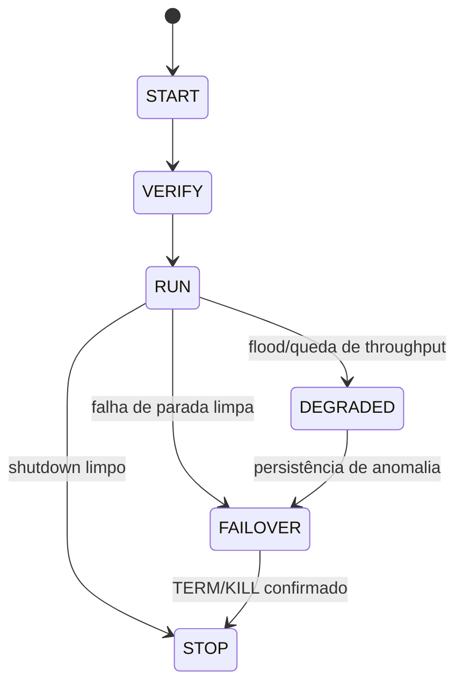
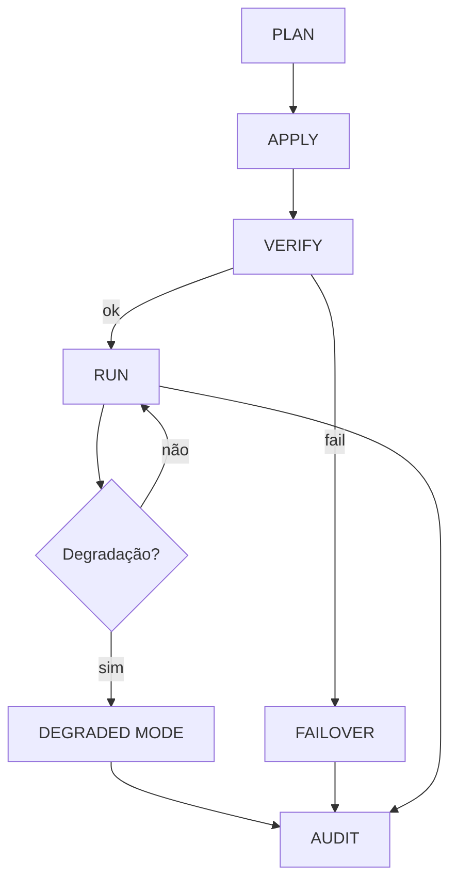
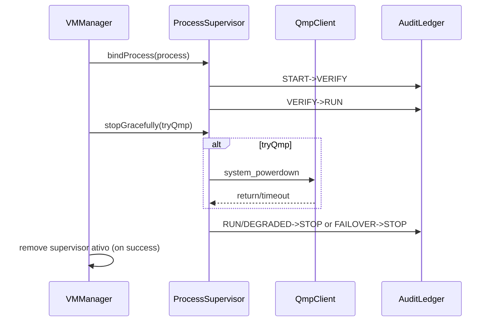

# Arquitetura — Execução, Supervisão e Observabilidade

## 1) Componentes
| Componente | Responsabilidade | Garantias |
|---|---|---|
| `Terminal.streamLog` | Captura stdout/stderr | Sem bloqueio sequencial; degrada sob flood |
| `ProcessOutputDrainer` | Drenagem paralela | Evita deadlock de pipe |
| `TokenBucketRateLimiter` | Limite de linhas/s | Backpressure por drop contabilizado |
| `BoundedStringRingBuffer` | Buffer bounded | Limite de memória por linhas+bytes |
| `ProcessSupervisor` | Estado de processo VM | STOP escalonado e failover determinístico |
| `AuditLedger` | Ledger operacional | Registro rotativo não bloqueante |

## 2) Estado do Supervisor

## 3) Fluxo operacional PLAN→APPLY→VERIFY→AUDIT

## 4) Política de logs (backpressure)
- Drenagem concorrente de stdout/stderr.
- Bucket por taxa para evitar spam de UI.
- Buffer circular com teto de linhas e bytes.
- Modo `DEGRADED` com contador de dropped logs e evento de auditoria.

## 5) Política de parada/failover
1. Tentar desligamento limpo (QMP) quando disponível.
2. Timeout curto de verificação.
3. Fallback para `TERM`.
4. Fallback final para `KILL`.
5. Confirmar morte com `waitFor(timeout)`.

## 6) Interface operacional VMManager ↔ ProcessSupervisor
- `VMManager.registerVmProcess(...)` cria/recupera supervisor por `vmId` e vincula processo.
- `VMManager.stopVmProcess(...)` executa parada escalonada e remove supervisor do mapa ativo quando a parada confirma `true`.
- `ProcessSupervisor` preserva trilha de transição em `AuditLedger` para auditoria determinística.

