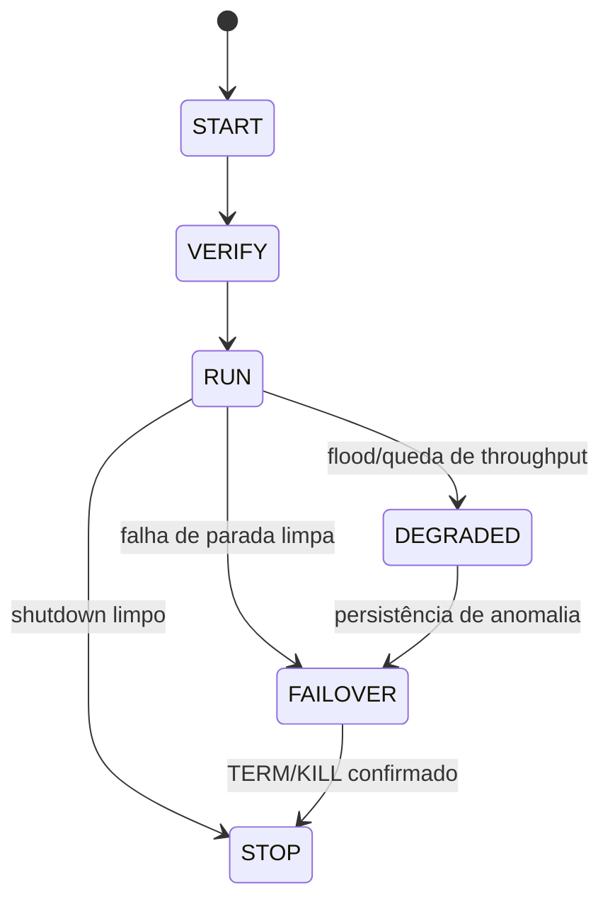
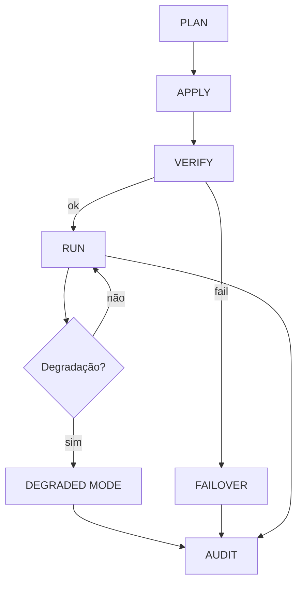
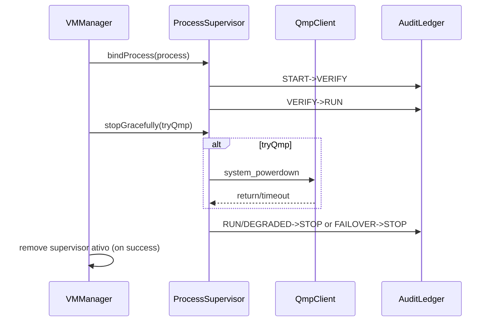

<!-- DOC_ORG_SCAN: 2026-04-07 | source-scan: pending-manual-by-domain -->

# Arquitetura — Execução, Supervisão e Observabilidade

## 0) Blueprint de fluxos operacionais
- Fluxos canônicos (criação, importação, execução e diagnóstico): [`docs/BLUEPRINT_FLUXOS_VM.md`](BLUEPRINT_FLUXOS_VM.md).

## 1) Componentes
| Componente | Responsabilidade | Garantias |
|---|---|---|
| `Terminal.streamLog` | Captura stdout/stderr | Sem bloqueio sequencial; degrada sob flood |
| `ProcessOutputDrainer` | Drenagem paralela | Evita deadlock de pipe |
| `TokenBucketRateLimiter` | Limite de linhas/s | Backpressure por drop contabilizado |
| `BoundedStringRingBuffer` | Buffer bounded | Limite de memória por linhas+bytes |
| `ProcessSupervisor` | Estado de processo VM | STOP escalonado e failover determinístico |
| `AuditLedger` | Ledger operacional | Registro rotativo não bloqueante |

## 2) Estado do Supervisor

## 3) Fluxo operacional PLAN→APPLY→VERIFY→AUDIT

## 4) Política de logs (backpressure)
- Drenagem concorrente de stdout/stderr.
- Bucket por taxa para evitar spam de UI.
- Buffer circular com teto de linhas e bytes.
- Modo `DEGRADED` com contador de dropped logs e evento de auditoria.

## 5) Política de parada/failover
1. Tentar desligamento limpo (QMP) quando disponível.
2. Timeout curto de verificação.
3. Fallback para `TERM`.
4. Fallback final para `KILL`.
5. Confirmar morte com `waitFor(timeout)`.

## 6) Interface operacional VMManager ↔ ProcessSupervisor
- `VMManager.registerVmProcess(...)` cria/recupera supervisor por `vmId` e vincula processo.
- `VMManager.stopVmProcess(...)` executa parada escalonada e remove supervisor do mapa ativo quando a parada confirma `true`.
- `ProcessSupervisor` preserva trilha de transição em `AuditLedger` para auditoria determinística.

## 7) Fonte de verdade de determinismo
- O determinismo matemático e de política (CRC32C, paridade 4x4, verificação de bloco, roteamento e transição de política de evento) reside no core C unificado em `engine/rmr` e é exposto para Android via JNI (`vectra_core_accel`).
- O Kotlin mantém fluxo de app e integração Android (Context, lifecycle, IO de alto nível), atuando como camada de marshaling/orquestração para chamadas determinísticas do core.

## 8) Decisão arquitetural — backend de observabilidade no `app/`
- Direção adotada: **BLP local-first para desenvolvimento**, preservando **Firebase real para compatibilidade de release/perfRelease**.
- O fluxo padrão (`debug`/local) não depende de `google-services.json`.
- Para `perfRelease`/`release`, o arquivo `app/google-services.json` real continua obrigatório e validado por `validateFirebaseReleaseConfig`.
- No CI, builds de release/perfRelease só rodam quando o segredo `VECTRAS_GOOGLE_SERVICES_JSON_B64` está configurado; sem segredo, o pipeline pula essa trilha explicitamente.

## 9) Mapa de módulos — refatoração incremental (VMManager + SetupFeatureCore)

### 9.1 VM lifecycle / start path
| Camada | Módulo/Classe | Papel |
|---|---|---|
| Orquestração de fluxo | `VMManager` | Coordena ciclo de vida da VM, delegando regras puras e integrações especializadas. |
| Validações e parsing | `VmCommandSafetyValidator` | Regras puras de segurança para comando de inicialização do QEMU. |
| Validações e parsing | `VmJsonParser` | Parse de lista de VMs e validação de posição sem acoplamento à UI. |
| Validações e parsing | `VmImageCommandRules` | Regra pura de limites de tamanho para criação de imagem RAW, isolando parsing do token final. |
| UI/estado de tela | `VMManager` (`latestUnsafeCommandReason`) | Mapeia `Reason` para mensagens de UI (`R.string.*`). |

### 9.2 Setup wizard / preflight
| Camada | Módulo/Classe | Papel |
|---|---|---|
| Orquestração de fluxo | `SetupFlowOrchestrator` | Decisão incremental de fluxo bootstrap/distro e gate do diretório `distro/bin`. |
| Integração com processos/shell/QEMU | `SetupProcessIntegration` | Normaliza validação de retorno de extração `tar` (timeout/erro/exit/stderr). |
| Validações e parsing | `SetupPreflightRules` | Parsing de tokens de pacotes e verificação em `apk/db/installed`. |
| Validações e parsing | `SetupValidationParser` | Validação de integridade do arquivo TAR extraído (`extensão`, existência, tamanho mínimo). |
| UI/estado de tela | `SetupUiState` | Regra de exibição de aviso de ABI em setup wizard sem acoplamento de `DialogUtils` na regra. |
| UI/estado de tela | `SetupFeatureCore.PreflightResult` | `uiSummary()` e serialização de falhas para interação de tela. |

### 9.3 Meta de tamanho de classe (incremental)
- Meta operacional: **600–800 linhas por classe** para classes de domínio/app.
- Estado atual prioritário: `VMManager` e `SetupFeatureCore` seguem acima da meta e passam por extrações progressivas por camada.
- Regra de evolução: cada alteração funcional nessas classes deve extrair ao menos uma unidade coesa para módulo dedicado + teste unitário focado.

## Metadados
- Versão do documento: 1.3
- Última atualização: 2026-04-06
- Commit de referência: `a70a4d9`
- Domínio de código coberto: Arquitetura operacional VM (app Android + supervisor/runtime + engine C/JNI).
